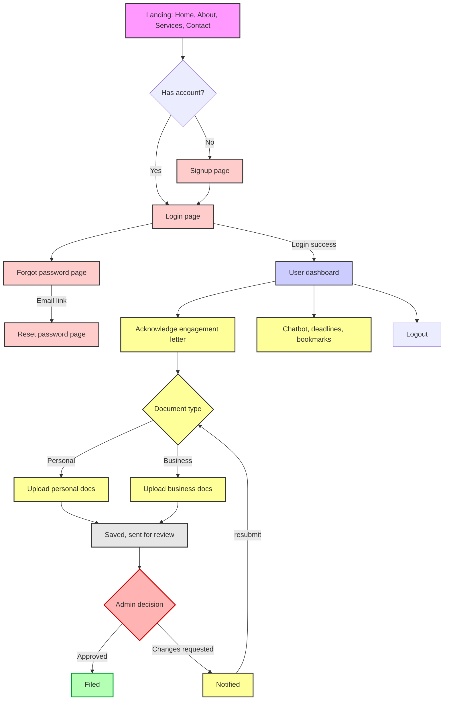
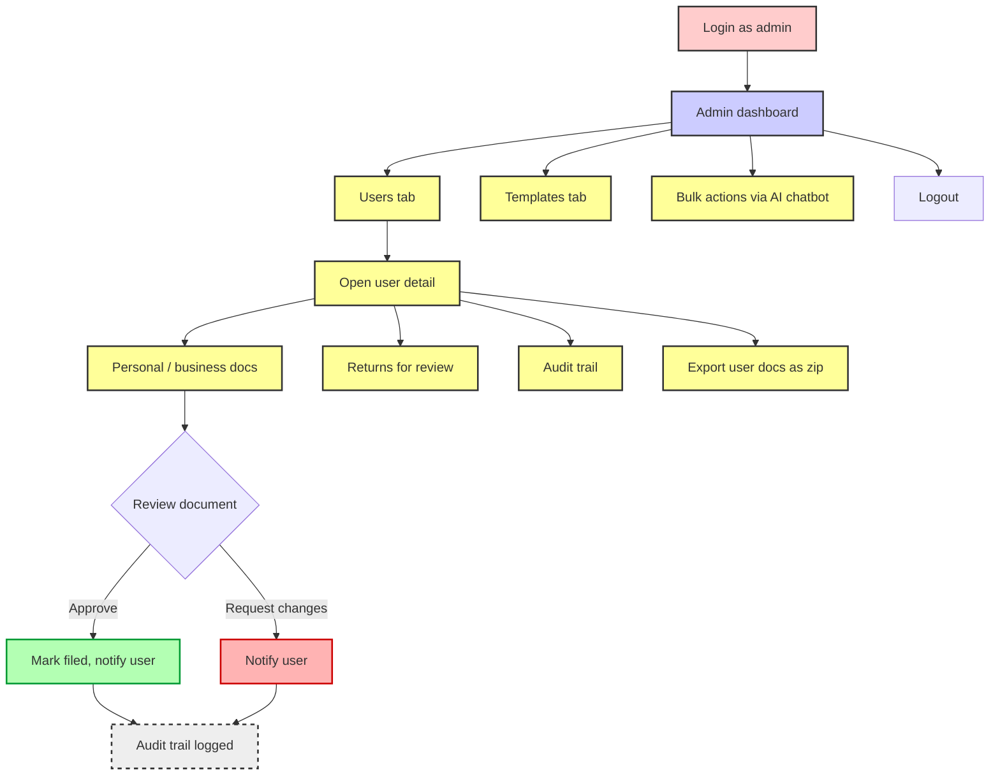
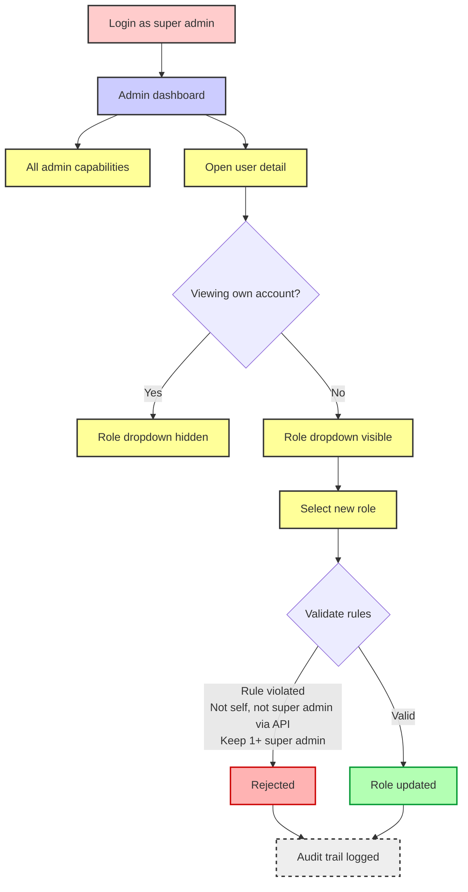

# Bookkeepro Workflows

This document visualizes the step-by-step journeys for Users, Admins, and Super Admins based on the core system logic.

## 1. User Workflow

---

## 2. Admin Workflow

---

## 3. Super Admin Workflow

